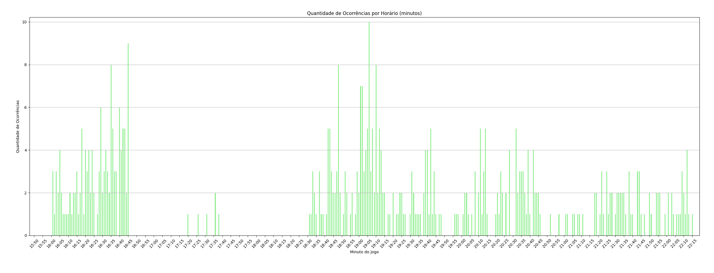

Acessados em 28/10/2024 no site
https://portaldegovernanca.cbf.com.br/documentos-da-partida

Utilizando selenium para acessar a página automaticamente
e então fazer o download dos PDFs

Utilizando PyPDF2 para ler os PDFs e extrair os dados
necessários para as análises

Utilizando pandas e matplotlib.pyplot para fazer a análise
e criação dos gráficos

Base:
Analisar se horário de início do jogo tem associação com
cartões amarelos e vermelhos de uma partida

